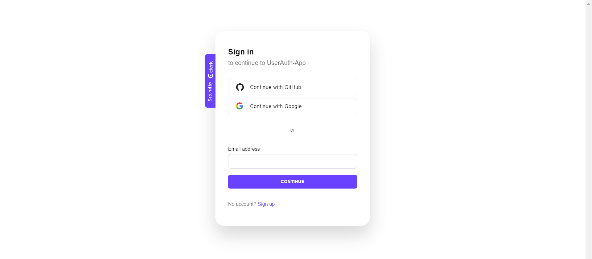
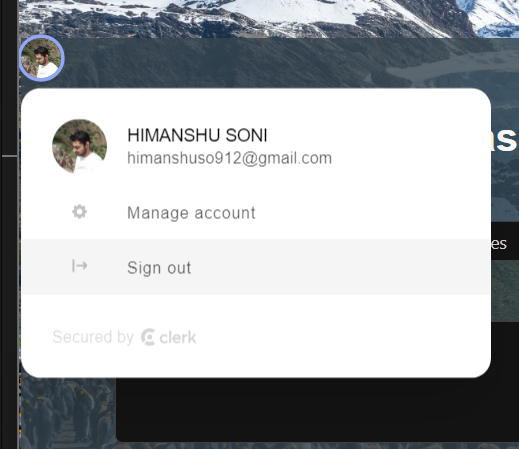

# React + Vite

# to run this App locally : first install dependencies folder by "npm install" then write "npm run dev"

link to the project - https://authentication-dashboard.vercel.app/

I made an authentication dashboard using React + vite with the help of Ant d library which a UI Component Library and Clerk authentication 

this website is a completley responsive website

which has user authentication - sign in , sign out , register features . 

in the dash board part their is a dynamic input which will resolving user's Queries form the different department. 

here are some screenshots of the project :

